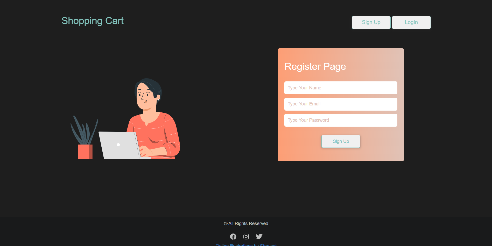
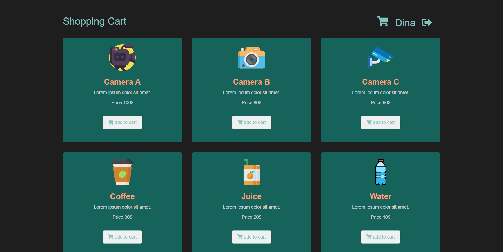
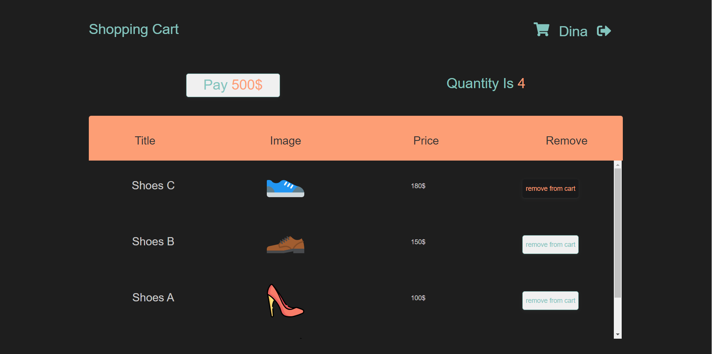

# Shopping-cart-js

<h2>About project :- </h2>

Shopping cart is an app to sell prodcus online 

 
<h2>Technical skills :-</h2>
<ul>
   <li>Bootstrap</li>
   <li>SASS</li>
   <li>JS DOM</li>
</ul>

 

 

 

 

<h2>Features :-</h2>
<ul>
   <li>Stickyheader</li>
</ul>

<h2>User experience :-</h2>

The users cannot add to cart unless firstly register
when registraion authentication has done they can see all products and can click on add to cart button then open the cart page to view all selected products and can remove any one from cart

